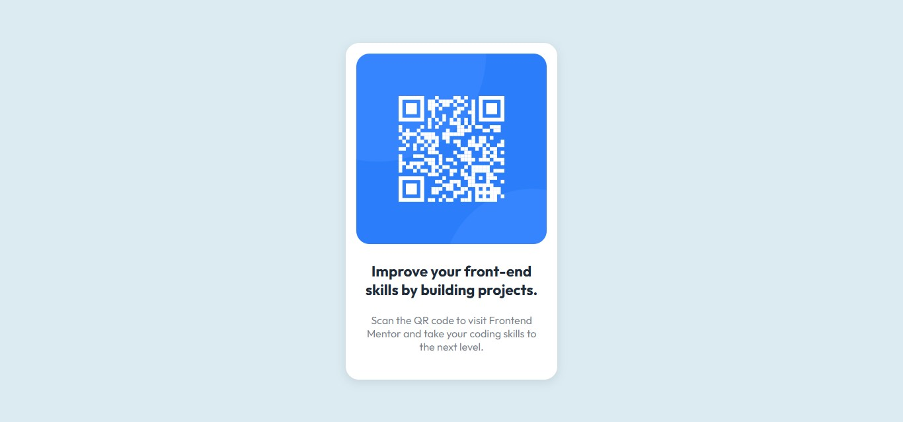

Thanks for sharing all the details! Here's a `README.md` file for your project based on the HTML, CSS, and template provided:

---

# Frontend Mentor - QR Code Component Solution

This is my solution to the [QR Code Component Challenge on Frontend Mentor](https://www.frontendmentor.io/challenges/qr-code-component-iux_sIO_H). This challenge helped me improve my HTML and CSS skills by creating a visually appealing and responsive QR code component.

## Table of Contents

- [Overview](#overview)
  - [Screenshot](#screenshot)
  - [Links](#links)
- [My Process](#my-process)
  - [Built With](#built-with)
  - [What I Learned](#what-i-learned)
  - [Continued Development](#continued-development)
  - [Useful Resources](#useful-resources)
- [Author](#author)
- [Acknowledgments](#acknowledgments)

## Overview

### Screenshot



### Links

- **Solution URL**: [View my solution](https://your-solution-url.com)
- **Live Site URL**: [View live site](https://cute-position.surge.sh/)

## My Process

### Built With

- Semantic HTML5 markup
- CSS Flexbox for layout
- Mobile-first responsive design
- Google Fonts for typography

### What I Learned

This project allowed me to practice creating a clean, responsive layout using Flexbox. I also improved my understanding of semantic HTML and how to apply consistent styling with CSS custom properties. Here's a small snippet of CSS I implemented:

```css
.card {
  background-color: white;
  border-radius: 20px;
  box-shadow: 0 4px 15px rgba(0, 0, 0, 0.1);
  display: flex;
  flex-direction: column;
  padding: 1rem;
}
```

### Continued Development

I plan to focus on the following areas in future projects:

- Improving accessibility for screen readers.
- Enhancing responsiveness for different screen sizes.
- Experimenting with CSS Grid for more complex layouts.

### Useful Resources

- [MDN Web Docs](https://developer.mozilla.org/) - Comprehensive guides on HTML and CSS.
- [CSS-Tricks Flexbox Guide](https://css-tricks.com/snippets/css/a-guide-to-flexbox/) - Helped with understanding Flexbox layouts.
- [Google Fonts](https://fonts.google.com/) - To find and use beautiful fonts.

## Author

- **Frontend Mentor Profile**: [@yourusername](https://www.frontendmentor.io/profile/yourusername)
- **Twitter**: [@yourusername](https://www.twitter.com/yourusername)

## Acknowledgments

Big thanks to the Frontend Mentor community for providing challenges like this to help developers grow. This project was a fun way to practice my skills!

---

Let me know if you'd like any further adjustments! 😊
