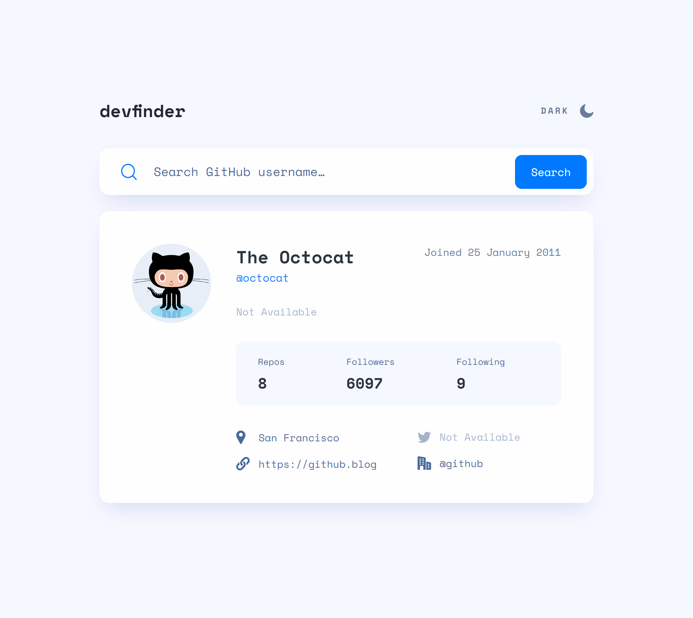

# Frontend Mentor - GitHub user search app solution

This is a solution to the [GitHub user search app challenge on Frontend Mentor](https://www.frontendmentor.io/challenges/github-user-search-app-Q09YOgaH6). Frontend Mentor challenges help you improve your coding skills by building realistic projects.

## Table of contents

- [Overview](#overview)
  - [The challenge](#the-challenge)
  - [Screenshot](#screenshot)
  - [Links](#links)
- [My process](#my-process)
  - [Built with](#built-with)
  - [What I learned](#what-i-learned)
  - [Continued development](#continued-development)
  - [Useful resources](#useful-resources)
- [Author](#author)
- [Acknowledgments](#acknowledgments)


## Overview

### The challenge

Users should be able to:

- View the optimal layout for the app depending on their device's screen size
- See hover states for all interactive elements on the page
- Search for GitHub users by their username
- See relevant user information based on their search
- Switch between light and dark themes
- **Bonus**: Have the correct color scheme chosen for them based on their computer preferences. _Hint_: Research `prefers-color-scheme` in CSS.

### Screenshot



### Links

- Solution URL: [https://www.frontendmentor.io/solutions/github-user-search-app-with-sass-CXRXtWXnaa](https://www.frontendmentor.io/solutions/github-user-search-app-with-sass-CXRXtWXnaa)
- Live Site URL: [https://miguelzaga.github.io/github-user-search-app/](https://miguelzaga.github.io/github-user-search-app/)

## My process

### Built with

- Sass
- CSS custom properties
- Flexbox

### What I learned

#### prefers-color-scheme

This is my first time using this media query. There are many ways to implement the dark mode. I found one that kept the css simple. Using css custom properties and javascript to notice the initial user configuration and then overriding it if wanted. The javascript is based on Ekaterina Vujasinović's [guide](https://www.ditdot.hr/en/dark-mode-website-tutorial).

```css
:root {
  // Colors - Light Mode
  --color-font-1: #2b3442;
  --color-font-2: #4b6a9b;
  --color-font-3: #697c9a;
  --color-title: #222731;
  --color-bg-1: #f6f8ff;
  --color-bg-2: #fefefe;
  --color-hover-toggle: #222731;
}

.dark {
  --color-font-1: #fff;
  --color-font-2: #fff;
  --color-font-3: #fff;
  --color-title: #fff;
  --color-bg-1: #141d2f;
  --color-bg-2: #1e2a47;
  --color-hover-toggle: #90a4d4;
}
```

```js
  function setUpDarkMode() {
    function toggleThemeBtn() {
      document.getElementById("toggle-light").classList.toggle("hidden");
      document.getElementById("toggle-dark").classList.toggle("hidden");
    }

    function toggleDarkMode(state) {
      document.documentElement.classList.toggle("dark", state);
    }

    const useDark = window.matchMedia("(prefers-color-scheme: dark)");
    useDark.addEventListener("change", function listenToThemeChange(e) {
      toggleDarkMode(e.matches);
      toggleThemeBtn();
    });

    // Initialize dark mode if matches with OS settings
    toggleDarkMode(useDark.matches);

    // Adds event listener to toggle dark mode with btn
    themeBtn.addEventListener("click", function toggleTheme(e) {
      document.documentElement.classList.toggle("dark");
      toggleThemeBtn();
    });
  }
}
```

### Continued development

I want to improve my usage of API and async functions.

### Useful resources

- [prefers-color-scheme](https://developer.mozilla.org/en-US/docs/Web/CSS/@media/prefers-color-scheme) - This helped me to understand the basics of this media query.
- [caret-color](https://developer.mozilla.org/en-US/docs/Web/CSS/caret-color) - I didn't know you could change the caret's color, very cool.
- [flex-shrink](https://developer.mozilla.org/en-US/docs/Web/CSS/flex-shrink) - This helped me handle the search bar when there is the 'no result' message and keep a nice layout.
- [Dark Mode - The prefers-color-scheme Website Tutorial](https://www.ditdot.hr/en/dark-mode-website-tutorial) - A great tutorial on how to implement a dark mode with a toggle button.

## Author

- Website - [Miguel Zapata](https://www.miguezaga.online)
- Frontend Mentor - [@miguelzaga](https://www.frontendmentor.io/profile/miguelzaga)

## Acknowledgments

I want to thank Ekaterina Vujasinović for her amazing article that helped me build the dark theme.